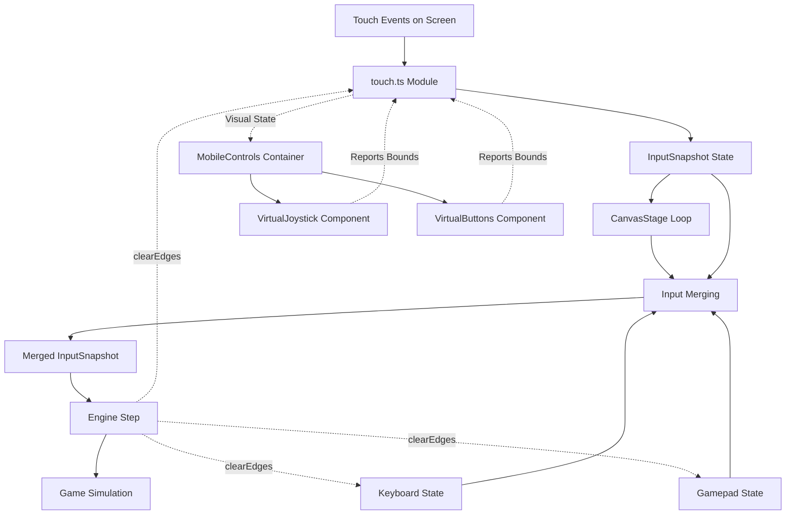
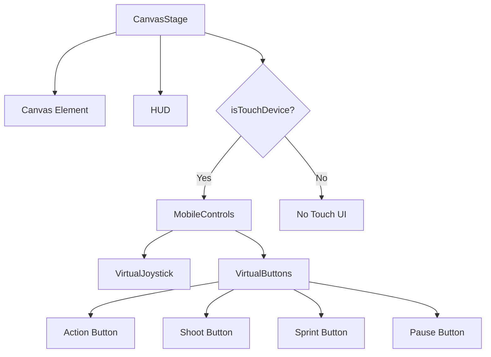

# Mobile Touch Controls Architecture

This document specifies the design for adding virtual joystick and button controls to Road to the Cup 2026, enabling full mobile/tablet gameplay while maintaining desktop keyboard/gamepad functionality.

## Design Principles

1. **Pattern Consistency**: Follow the exact same `InputSnapshot` interface as [`keyboard.ts`](../lib/game/input/keyboard.ts:1) and [`gamepad.ts`](../lib/game/input/gamepad.ts:1)
2. **Non-Invasive**: Mobile controls are additive; desktop controls remain unchanged
3. **Conditional Rendering**: Virtual controls appear only on touch-capable devices
4. **Performance**: Touch event handling must not impact the main game loop
5. **Ergonomics**: Controls positioned for comfortable thumb reach on phones/tablets

---

## 1) File Structure

New files to be created:

```
lib/game/input/
  └── touch.ts              # Touch input module (core logic)

components/game/ui/touch/
  ├── MobileControls.tsx    # Container component (conditionally rendered)
  ├── VirtualJoystick.tsx   # Left-side joystick component
  └── VirtualButtons.tsx    # Right-side button panel

lib/utils/
  └── device.ts             # Mobile detection utilities
```

### Rationale for Structure

- **`touch.ts`** lives alongside `keyboard.ts` and `gamepad.ts` in [`lib/game/input/`](../lib/game/input/keyboard.ts:1) to maintain input module consistency
- **Touch UI components** go in `components/game/ui/touch/` as a distinct subdirectory since they're visual elements (unlike the headless keyboard/gamepad modules)
- **`device.ts`** utility module handles platform detection logic, reusable across the app

---

## 2) Touch Input Module Design

### File: `lib/game/input/touch.ts`

**Purpose**: Manage touch events and produce `InputSnapshot` state matching the pattern of keyboard/gamepad modules.

**API Surface** (must match existing pattern):

```typescript
export type TouchInput = {
  state: InputSnapshot;
  clearEdges: () => void;
  dispose: () => void;
};

export function createTouchInput(): TouchInput;
```

**Internal State**:

```typescript
type TouchState = {
  // Joystick tracking
  joystickTouchId: number | null;
  joystickOrigin: { x: number; y: number } | null;
  joystickCurrent: { x: number; y: number } | null;
  
  // Button tracking (by touch identifier)
  activeTouches: Map<number, ButtonType>;
  
  // Hold durations for charge mechanics
  actionHoldStart: number | null;
  shootHoldStart: number | null;
};

type ButtonType = 'action' | 'shoot' | 'sprint' | 'pause';
```

**Key Behaviors**:

1. **Joystick Movement**:
   - First touch in left zone establishes joystick origin
   - Track touch drag to compute direction vector
   - Normalize to produce `moveVec` in range `[-1, 1]`
   - Apply deadzone (e.g., 15% of max radius) to prevent jitter
   - Clear on touch end/cancel

2. **Button Presses**:
   - Touch start in button zone → set `*Pressed` edge flag + `*Down` hold flag
   - Touch end → set `*Released` edge flag, clear `*Down`
   - Track which touch ID owns which button to handle multi-touch
   - Support simultaneous button presses (e.g., sprint + shoot)

3. **Edge Flag Management**:
   - Edge flags (`*Pressed`, `*Released`) set true on touch events
   - `clearEdges()` called by CanvasStage after each sim step
   - Hold flags (`*Down`) persist until touch ends

4. **Multi-Touch Strategy**:
   - Allow up to 5 simultaneous touches (joystick + 4 buttons)
   - Use `TouchEvent.changedTouches` and track by `identifier`
   - Prevent touch crosses (joystick touch can't move to button zone)

**Event Registration**:

```typescript
// Register on a target element (passed to createTouchInput)
function createTouchInput(targetElement: HTMLElement): TouchInput {
  const state: InputSnapshot = { /* ... */ };
  
  const handleTouchStart = (e: TouchEvent) => { /* ... */ };
  const handleTouchMove = (e: TouchEvent) => { /* ... */ };
  const handleTouchEnd = (e: TouchEvent) => { /* ... */ };
  const handleTouchCancel = (e: TouchEvent) => { /* ... */ };
  
  targetElement.addEventListener('touchstart', handleTouchStart, { passive: false });
  targetElement.addEventListener('touchmove', handleTouchMove, { passive: false });
  targetElement.addEventListener('touchend', handleTouchEnd, { passive: false });
  targetElement.addEventListener('touchcancel', handleTouchCancel, { passive: false });
  
  return {
    state,
    clearEdges: () => { /* clear edge flags */ },
    dispose: () => { /* remove listeners */ }
  };
}
```

**Coordinate Mapping**:
- Touch coordinates (`e.touches[i].clientX/Y`) are relative to viewport
- Components pass their bounding boxes to the touch module
- Module translates client coordinates to relative positions within each control zone

---

## 3) Virtual Joystick Component

### File: `components/game/ui/touch/VirtualJoystick.tsx`

**Purpose**: Render visual joystick with dynamic stick position; report touch zone bounds to touch module.

**Props**:

```typescript
type VirtualJoystickProps = {
  onBoundsChange: (bounds: DOMRect | null) => void;
  active: boolean;          // Whether touch is currently active
  stickOffset: Vec2;        // Current stick position (relative to origin)
  maxRadius: number;        // Max stick travel distance (logical units)
};
```

**Visual Design**:

1. **Base (outer circle)**:
   - Diameter: `120px` (CSS)
   - Background: `rgba(255, 255, 255, 0.1)`
   - Border: `2px solid rgba(255, 255, 255, 0.3)`
   - Position: Fixed at `32px` from bottom-left corner

2. **Stick (inner circle)**:
   - Diameter: `50px`
   - Background: `rgba(255, 255, 255, 0.5)`
   - Border: `2px solid rgba(255, 255, 255, 0.8)`
   - Transform based on `stickOffset` prop
   - Returns to center when touch ends

3. **Active State**:
   - Increase opacity: base `0.15`, stick `0.7`
   - Add subtle glow/shadow to stick

**Layout**:
```
Position: fixed
Bottom: 32px
Left: 32px
Width: 120px
Height: 120px
Z-index: 1000
```

**Implementation Notes**:
- Use `useEffect` with `ResizeObserver` to report bounding box changes
- Stick position calculated by parent logic, component is purely presentational
- Add `touch-action: none` to prevent browser gestures

---

## 4) Virtual Buttons Component

### File: `components/game/ui/touch/VirtualButtons.tsx`

**Purpose**: Render a panel of action buttons; report touch zones to touch module.

**Props**:

```typescript
type VirtualButtonsProps = {
  onBoundsChange: (buttonId: ButtonType, bounds: DOMRect | null) => void;
  activeButtons: Set<ButtonType>;  // Which buttons are currently pressed
};

type ButtonType = 'action' | 'shoot' | 'sprint' | 'pause';
```

**Button Definitions**:

| Button | Label | Icon/Text | Size | Position (relative) | Color |
|--------|-------|-----------|------|---------------------|-------|
| **Action** | Pass/Switch | `⚡` or "ACTION" | 70px | Top-left of panel | Yellow `#FFD700` |
| **Shoot** | Shoot | `⚽` or "SHOOT" | 80px | Top-right (primary) | Red `#FF4444` |
| **Sprint** | Sprint | `>>` or "SPRINT" | 60px | Bottom-left | Blue `#4488FF` |
| **Pause** | Pause | `❚❚` or "PAUSE" | 50px | Top-center | Gray `#888888` |

**Layout Strategy**:

```
Panel container:
  Position: fixed
  Bottom: 32px
  Right: 32px
  Width: 200px
  Height: 180px
  Display: grid
  Grid template: 2 rows × 3 columns with gaps

Button layout:
  [Pause] [Shoot]
  [Action] [Sprint]
```

**Visual Design per Button**:

1. **Shape**: Rounded rectangle with `border-radius: 12px`
2. **Background**: Semi-transparent color (listed above) with `opacity: 0.3`
3. **Border**: `2px solid` version of base color with `opacity: 0.6`
4. **Text**: White, bold, `14px` for label below icon
5. **Active state** (pressed):
   - Increase opacity to `0.6`
   - Add inner shadow: `inset 0 4px 8px rgba(0,0,0,0.3)`
   - Scale down slightly: `transform: scale(0.95)`

**Touch Feedback**:
- Immediate visual response on touch (no delay)
- Maintain pressed state for entire touch duration
- Support simultaneous presses (e.g., sprint + shoot)

**Accessibility Considerations**:
- Large touch targets (minimum 44px × 44px per Apple/Android guidelines)
- Adequate spacing between buttons (16px gaps)
- High contrast ratios for visibility in various lighting

---

## 5) Mobile Controls Container

### File: `components/game/ui/touch/MobileControls.tsx`

**Purpose**: Orchestrate joystick + buttons; bridge between visual components and touch input module.

**Props**:

```typescript
type MobileControlsProps = {
  touchInputRef: React.MutableRefObject<TouchInput | null>;
};
```

**Responsibilities**:

1. **Coordinate Tracking**:
   - Receive bounding boxes from `VirtualJoystick` and `VirtualButtons`
   - Pass bounds to `TouchInput` module for hit testing
   - Update when window resizes or orientation changes

2. **Visual State Sync**:
   - Poll `touchInputRef.current.state` each frame (via RAF)
   - Derive visual props for joystick (stick offset) and buttons (active set)
   - Pass to child components for rendering

3. **Lifecycle Management**:
   - Render children only when `touchInputRef` is initialized
   - Handle cleanup if component unmounts

**Implementation Pattern**:

```typescript
export function MobileControls({ touchInputRef }: MobileControlsProps) {
  const [joystickState, setJoystickState] = useState({ active: false, offset: { x: 0, y: 0 } });
  const [activeButtons, setActiveButtons] = useState<Set<ButtonType>>(new Set());
  
  // Visual state update loop
  useEffect(() => {
    let rafId: number;
    const updateVisuals = () => {
      const input = touchInputRef.current;
      if (input) {
        // Read touch module's internal state (via new exposed getVisualState method)
        // Update component state for rendering
      }
      rafId = requestAnimationFrame(updateVisuals);
    };
    rafId = requestAnimationFrame(updateVisuals);
    return () => cancelAnimationFrame(rafId);
  }, [touchInputRef]);
  
  const handleJoystickBounds = useCallback((bounds: DOMRect | null) => {
    // Pass to touch module
  }, [touchInputRef]);
  
  const handleButtonBounds = useCallback((buttonId: ButtonType, bounds: DOMRect | null) => {
    // Pass to touch module
  }, [touchInputRef]);
  
  return (
    <div style={{ position: 'fixed', inset: 0, pointerEvents: 'none', zIndex: 1000 }}>
      <VirtualJoystick
        onBoundsChange={handleJoystickBounds}
        active={joystickState.active}
        stickOffset={joystickState.offset}
        maxRadius={50}
      />
      <VirtualButtons
        onBoundsChange={handleButtonBounds}
        activeButtons={activeButtons}
      />
    </div>
  );
}
```

**Note on Pointer Events**:
- Container has `pointerEvents: 'none'` to allow touch through to canvas
- Individual controls have `pointerEvents: 'auto'` to capture touches

---

## 6) Mobile Detection Utility

### File: `lib/utils/device.ts`

**Purpose**: Provide reliable mobile/touch device detection.

**API**:

```typescript
export function isTouchDevice(): boolean;
export function isMobileDevice(): boolean;
export function getDeviceType(): 'mobile' | 'tablet' | 'desktop';
```

**Implementation Logic**:

```typescript
export function isTouchDevice(): boolean {
  if (typeof window === 'undefined') return false;
  
  // Check for touch events support
  return (
    'ontouchstart' in window ||
    navigator.maxTouchPoints > 0 ||
    (window.matchMedia?.('(pointer: coarse)').matches ?? false)
  );
}

export function isMobileDevice(): boolean {
  if (typeof window === 'undefined') return false;
  
  // Check viewport width + touch capability
  return isTouchDevice() && window.innerWidth < 768;
}

export function getDeviceType(): 'mobile' | 'tablet' | 'desktop' {
  if (!isTouchDevice()) return 'desktop';
  
  const width = window.innerWidth;
  if (width < 768) return 'mobile';
  return 'tablet';
}
```

**Rationale**:
- **`'ontouchstart' in window`**: Primary check for touch event API
- **`navigator.maxTouchPoints`**: Modern standard, more reliable
- **`matchMedia('(pointer: coarse)')`**: Detects primary input is touch
- **Width threshold**: 768px is industry standard mobile breakpoint

**Usage in CanvasStage**:
```typescript
const shouldShowTouchControls = isTouchDevice();
```

---

## 7) Integration with CanvasStage

### File: `components/game/CanvasStage.tsx`

**Changes Required**:

1. **Import mobile modules**:
```typescript
import { createTouchInput } from "@/lib/game/input/touch";
import { MobileControls } from "@/components/game/ui/touch/MobileControls";
import { isTouchDevice } from "@/lib/utils/device";
```

2. **Add touch input ref** (alongside keyboard/gamepad):
```typescript
const touchRef = useRef<ReturnType<typeof createTouchInput> | null>(null);
```

3. **Initialize touch input** (in main useEffect, line ~118):
```typescript
// After creating keyboard and gamepad:
const touch = createTouchInput(document.body);
touchRef.current = touch;
```

4. **Update input merging logic** (in loop function, line ~192):
```typescript
const kb = keyboardRef.current?.state;
const gp = gamepadRef.current?.state;
const touch = touchRef.current?.state;
const merged = inputRef.current;

if (merged && kb && gp && touch) {
  // Priority: touch > gamepad > keyboard (for movement)
  const touchMoveActive = touch.moveVec.x * touch.moveVec.x + touch.moveVec.y * touch.moveVec.y > 1e-6;
  const gpMoveActive = gp.moveVec.x * gp.moveVec.x + gp.moveVec.y * gp.moveVec.y > 1e-6;
  
  merged.moveVec = touchMoveActive ? touch.moveVec : (gpMoveActive ? gp.moveVec : kb.moveVec);
  
  // OR all button inputs
  merged.sprint = kb.sprint || gp.sprint || touch.sprint;
  
  merged.actionDown = kb.actionDown || gp.actionDown || touch.actionDown;
  merged.actionPressed = kb.actionPressed || gp.actionPressed || touch.actionPressed;
  merged.actionReleased = kb.actionReleased || gp.actionReleased || touch.actionReleased;
  
  merged.shootDown = kb.shootDown || gp.shootDown || touch.shootDown;
  merged.shootReleased = kb.shootReleased || gp.shootReleased || touch.shootReleased;
  
  merged.pausePressed = kb.pausePressed || touch.pausePressed;
}
```

5. **Clear touch edges** (line ~235):
```typescript
keyboardRef.current?.clearEdges();
gamepadRef.current?.clearEdges();
touchRef.current?.clearEdges();
```

6. **Dispose touch input** (cleanup function, line ~282):
```typescript
touchRef.current?.dispose();
touchRef.current = null;
```

7. **Conditionally render mobile controls** (return statement, line ~298):
```typescript
return (
  <div style={{ position: "fixed", inset: 0, overflow: "hidden" }}>
    <canvas ref={canvasRef} />
    
    {vm ? <Hud vm={vm} hudMeta={hudMetaRef.current} layout={{ topPx: UI_TOP_PX, bottomPx: UI_BOTTOM_PX }} /> : null}
    
    {isTouchDevice() && touchRef.current ? (
      <MobileControls touchInputRef={touchRef} />
    ) : null}
  </div>
);
```

**Input Priority Logic**:
- **Movement**: Touch > Gamepad > Keyboard (first active wins)
- **Buttons**: OR'd together (any source can trigger action)
- **Rationale**: Touch users won't have keyboard/gamepad, but desktop users with touchscreens should be able to mix inputs

---

## 8) UI/UX Guidelines

### Visual Design Constraints

1. **Theme Consistency**:
   - Use semi-transparent overlays to avoid obscuring gameplay
   - Match HUD color scheme (currently undefined, assume white with transparency)
   - Maintain visual hierarchy: controls are tools, not decorations

2. **Opacity Levels**:
   - **Idle**: 30% opacity (visible but not distracting)
   - **Active/Pressed**: 60% opacity (clear feedback)
   - **Disabled**: 15% opacity (if needed for tutorial modes)

3. **Safe Zones**:
   - Respect notches on iPhone X+: use `env(safe-area-inset-*)`
   - Bottom margin: 32px minimum (allows for home indicator)
   - Side margins: 32px minimum (thumb reach)

4. **Responsive Sizing**:
   - Phone portrait (< 768px): Full layout as specified
   - Tablet landscape (768px+): Increase button sizes by 1.2x
   - Tablet portrait: Same as phone

### Touch Interaction Design

1. **Joystick Mechanics**:
   - Deadzone: 15% of max radius (prevent drift)
   - Max radius: 50px from center (comfortable thumb sweep)
   - Return to center: Smooth spring animation (150ms ease-out)
   - Visual feedback: Stick follows finger with 1:1 mapping

2. **Button Mechanics**:
   - **Tap** (Action button): Press briefly to switch players / pass short
   - **Hold** (Action button): Hold to charge pass power (visual: pulsing border)
   - **Tap** (Shoot button): Quick shot with low power
   - **Hold + Release** (Shoot button): Charge shot, release to kick
   - **Toggle** (Sprint button): Each tap toggles sprint on/off (or hold)
   - **Tap** (Pause button): Immediate pause, no hold required

3. **Haptic Feedback** (optional enhancement):
   - Light tap on button press (if Web Vibration API available)
   - Stronger pulse on goal/event
   - Disable if battery saver mode active

### Performance Considerations

1. **Touch Event Throttling**:
   - Use `passive: false` only where necessary (for preventDefault)
   - Joystick touchmove: Allow high frequency (60Hz+), no throttling
   - Button zones: No special throttling needed

2. **Rendering Optimization**:
   - Joystick/button positions updated via RAF, not React state (avoid re-renders)
   - Use CSS transforms for stick position (GPU accelerated)
   - Minimize DOM updates: only update when visual state actually changes

3. **Memory Management**:
   - Reuse Vec2 objects for joystick calculations
   - Single Map for tracking active touches (not new Set per frame)
   - Clear touch references in touchend/cancel to prevent leaks

---

## 9) Screen Layout Mockup

Visual representation of control placement (portrait phone, 375×812px):

```
┌─────────────────────────────────────┐
│                                     │
│          [HUD - Score/Time]         │ ← 140px (existing UI_TOP_PX)
│                                     │
├─────────────────────────────────────┤
│                                     │
│                                     │
│                                     │
│         [GAME CANVAS]               │
│      Pitch renders here             │
│                                     │
│                                     │
│                                     │
├─────────────────────────────────────┤
│                                     │
│  ◉ [Joystick]       [Pause] [Shoot] │ ← Controls layer
│                     [Action][Sprint]│
│   32px from edges   →   ←   32px    │
└─────────────────────────────────────┘
     ↑                               ↑
  32px bottom margin          92px (existing UI_BOTTOM_PX)
```

**Dimensions**:
- Joystick: 120×120px circle, bottom-left
- Button panel: ~200×180px grid, bottom-right
- Gap between canvas and controls: Overlaid (controls have z-index 1000)

**Landscape Mode** (812×375px):

```
┌──────────────────────────────────────────────────────────────┐
│  [HUD - Score/Time]                                          │
├──────────────────────────────────────────────────────────────┤
│                                                              │
│  ◉                      [GAME CANVAS]         [Pause][Shoot] │
│ [Joy]                                         [Act] [Sprint] │
│                                                              │
└──────────────────────────────────────────────────────────────┘
```

Same positioning rules apply (32px margins).

---

## 10) Edge Cases & Error Handling

### Touch Event Edge Cases

1. **Multi-finger gestures conflicting with browser**:
   - Problem: Two-finger pinch could zoom page
   - Solution: Set `touch-action: none` on control elements, `passive: false` listeners, `preventDefault()` on touchstart

2. **Touch leaves control zone**:
   - Problem: User drags outside joystick/button bounds
   - Solution: Continue tracking until touchend/cancel; clamp joystick to max radius; buttons remain pressed until release

3. **Touch interrupted** (e.g., notification banner):
   - Problem: touchend never fires
   - Solution: Handle `touchcancel` identically to `touchend`; reset all states

4. **Rapid touches** (e.g., button mashing):
   - Problem: Edge flags might not clear between rapid presses
   - Solution: Ensure `clearEdges()` is called reliably after each sim step; use per-touch identifier tracking

5. **Screen rotation mid-game**:
   - Problem: Control bounds become invalid
   - Solution: ResizeObserver in each component recalculates and reports bounds; touch module invalidates old touch tracking on bounds change

### Device-Specific Issues

1. **iOS Safari address bar collapse**:
   - Problem: Viewport height changes dynamically
   - Solution: Already handled by [`CanvasStage.tsx`](../components/game/CanvasStage.tsx:162) `visualViewport` listeners; extend to MobileControls

2. **Android back button**:
   - Problem: Might exit app instead of pausing game
   - Solution: Not preventable via web; document expected behavior

3. **Tablet in desktop mode**:
   - Problem: Touch device but large screen (might prefer keyboard)
   - Solution: Show controls if `isTouchDevice()` returns true; user can simply not use them

### Performance Edge Cases

1. **Low-end device (< 30 FPS)**:
   - Problem: Touch input feels laggy
   - Solution: Touch state updates are independent of game FPS; ensure touch handling is in separate event handlers, not tied to RAF

2. **High touch frequency**:
   - Problem: Excessive touchmove events (120Hz+ on iPad Pro)
   - Solution: Accept all events; touch module updates internal state, but component visual updates are RAF-limited

---

## 11) Testing Strategy

Since this is a design document, the following testing approach should be followed during implementation:

### Unit Testing (Future Implementation)

1. **Touch module (`touch.ts`)**:
   - Mock TouchEvent objects
   - Test joystick vector calculation at various positions
   - Test button press/release edge flag transitions
   - Test multi-touch scenarios (simultaneous buttons)
   - Test coordinate mapping with different bounds

2. **Device detection (`device.ts`)**:
   - Mock window properties (`maxTouchPoints`, `matchMedia`)
   - Test classification for various devices

### Integration Testing

1. **CanvasStage integration**:
   - Verify input merging logic (touch + keyboard + gamepad)
   - Test edge flag clearing sequence
   - Verify proper disposal on unmount

2. **Visual component sync**:
   - Test joystick renders at correct position
   - Test button active states match touch module state

### Manual Testing Checklist

- [ ] Controls appear only on touch devices
- [ ] Joystick responds smoothly to touch drag
- [ ] Joystick resets to center on release
- [ ] All 4 buttons respond correctly (tap and hold)
- [ ] Can press multiple buttons simultaneously
- [ ] Sprint toggle works correctly
- [ ] Pause button pauses game
- [ ] Touch leaving control zone doesn't break state
- [ ] Screen rotation updates control positions
- [ ] Game plays correctly with touch controls
- [ ] Desktop keyboard still works (on hybrid devices)
- [ ] No browser zoom/scroll when using controls

---

## 12) Implementation Sequence

Recommended order for Code mode:

1. **Phase 1: Infrastructure**
   - Create `lib/utils/device.ts` with detection functions
   - Create `lib/game/input/touch.ts` skeleton with InputSnapshot state
   - Add touch input ref to [`CanvasStage.tsx`](../components/game/CanvasStage.tsx:1)

2. **Phase 2: Touch Module Logic**
   - Implement touch event handlers (start/move/end/cancel)
   - Implement joystick vector calculation
   - Implement button touch zone detection
   - Add edge flag management

3. **Phase 3: Visual Components**
   - Create `VirtualJoystick.tsx` with static positioning
   - Create `VirtualButtons.tsx` with button grid
   - Create `MobileControls.tsx` container

4. **Phase 4: Integration**
   - Connect touch module to visual components (bounds tracking)
   - Add input merging logic to CanvasStage loop
   - Add conditional rendering based on device type
   - Test edge flag clearing

5. **Phase 5: Polish**
   - Add active state animations
   - Optimize performance (throttle unnecessary updates)
   - Add safe-area-inset CSS for notched devices
   - Add visual feedback polish (opacity transitions, etc.)

**Estimated Implementation Time**: 4-6 hours for experienced React developer

---

## 13) Architecture Diagram

Data flow for mobile controls:



Component hierarchy:



---

## 14) Future Enhancements (Out of Scope)

Optional improvements for later iterations:

1. **Customizable Layout**:
   - Allow users to reposition controls
   - Save preferences to localStorage
   - Swap left/right for left-handed users

2. **Visual Themes**:
   - Match controls to team colors
   - Opacity slider in settings
   - Size adjuster (accessibility)

3. **Advanced Haptics**:
   - Vibration patterns for different actions
   - Intensity based on in-game events
   - GamepadHapticActuator API for supported devices

4. **Touch Gestures**:
   - Swipe up on joystick = instant sprint
   - Double-tap anywhere = switch player
   - Pinch = zoom camera (if camera zoom added)

5. **Tutorial Overlay**:
   - First-time user guidance
   - Highlight each control with explanation
   - Practice mode to test controls

---

## 15) Acceptance Criteria

The mobile controls implementation will be considered complete when:

- ✅ Virtual controls appear only on touch-capable devices
- ✅ Joystick provides smooth, responsive movement in all directions
- ✅ All 4 buttons (Action, Shoot, Sprint, Pause) function correctly
- ✅ Touch input integrates seamlessly with existing keyboard/gamepad
- ✅ Edge flags (press/release) are handled correctly for tap vs hold mechanics
- ✅ Multiple simultaneous touches work (e.g., sprint while moving)
- ✅ Controls don't obscure critical gameplay areas
- ✅ Performance remains at 60 FPS on mid-range mobile devices
- ✅ Screen rotation updates control positions correctly
- ✅ No browser gestures interfere with gameplay (zoom, scroll, etc.)
- ✅ Desktop keyboard controls continue to work on hybrid devices

---

## Appendix A: TypeScript Interfaces

Complete type definitions for reference:

```typescript
// lib/game/input/touch.ts

import type { InputSnapshot, Vec2 } from "../engine/engineTypes";

export type TouchInput = {
  state: InputSnapshot;
  clearEdges: () => void;
  dispose: () => void;
  
  // Additional methods for visual state sync
  getJoystickState: () => { active: boolean; offset: Vec2 };
  getActiveButtons: () => Set<ButtonType>;
  
  // Bounds registration from components
  setJoystickBounds: (bounds: DOMRect | null) => void;
  setButtonBounds: (button: ButtonType, bounds: DOMRect | null) => void;
};

export type ButtonType = 'action' | 'shoot' | 'sprint' | 'pause';

// components/game/ui/touch/VirtualJoystick.tsx

export type VirtualJoystickProps = {
  active: boolean;
  stickOffset: Vec2;
  maxRadius: number;
  onBoundsChange: (bounds: DOMRect | null) => void;
};

// components/game/ui/touch/VirtualButtons.tsx

export type VirtualButtonsProps = {
  activeButtons: Set<ButtonType>;
  onBoundsChange: (button: ButtonType, bounds: DOMRect | null) => void;
};

// components/game/ui/touch/MobileControls.tsx

export type MobileControlsProps = {
  touchInputRef: React.MutableRefObject<TouchInput | null>;
};
```

---

## Appendix B: CSS Snippets

Key CSS patterns for mobile controls:

```css
/* Container - allows touches through except on controls */
.mobile-controls-container {
  position: fixed;
  inset: 0;
  pointer-events: none;
  z-index: 1000;
  
  /* Respect device safe areas */
  padding: env(safe-area-inset-top) env(safe-area-inset-right) 
           env(safe-area-inset-bottom) env(safe-area-inset-left);
}

/* Joystick wrapper */
.virtual-joystick {
  position: fixed;
  bottom: 32px;
  left: 32px;
  width: 120px;
  height: 120px;
  pointer-events: auto;
  touch-action: none; /* Prevent browser gestures */
}

/* Button panel */
.virtual-buttons {
  position: fixed;
  bottom: 32px;
  right: 32px;
  pointer-events: auto;
  touch-action: none;
  display: grid;
  grid-template-columns: repeat(2, 1fr);
  grid-template-rows: repeat(2, 1fr);
  gap: 16px;
}

/* Button base style */
.virtual-button {
  display: flex;
  align-items: center;
  justify-content: center;
  border-radius: 12px;
  font-weight: bold;
  transition: opacity 0.1s, transform 0.1s;
  user-select: none;
  -webkit-user-select: none;
}

.virtual-button.active {
  opacity: 0.6;
  transform: scale(0.95);
  box-shadow: inset 0 4px 8px rgba(0, 0, 0, 0.3);
}
```

---

## Summary

This architecture provides a complete blueprint for adding mobile touch controls to Road to the Cup 2026 while:

1. Following the existing input module patterns ([`keyboard.ts`](../lib/game/input/keyboard.ts:1), [`gamepad.ts`](../lib/game/input/gamepad.ts:1))
2. Maintaining backward compatibility with desktop controls
3. Providing an ergonomic, responsive mobile experience
4. Keeping implementation complexity manageable
5. Ensuring high performance on mobile devices

The design is complete and ready for implementation by Code mode.