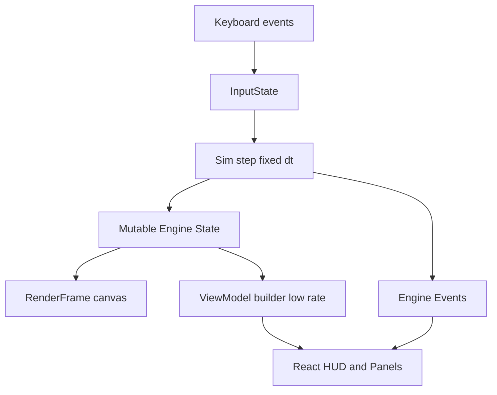
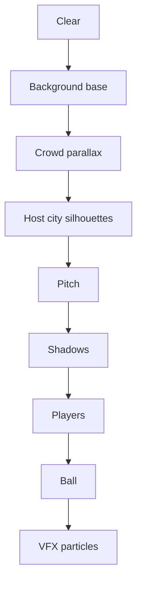

# Road to the Cup 2026 (Next.js App Router) — Implementation Plan + Architecture Spec

Repo baseline: Next.js App Router with React 19 + TS ([`package.json`](package.json:1)). The game should run as a single full-screen page rendered by a single canvas with React UI overlays.

Decisions confirmed:
- Tournament: 32 teams
- Match length: 6 in-game minutes (accelerated clock)
- Camera: fixed full-pitch
- Input: keyboard-only

---

## 1) Technical approach

### Rendering + UI strategy
- Use one `<canvas>` for all in-match rendering and VFX; update it in a continuous loop via `requestAnimationFrame`.
- Use React components for UI overlays (HUD, panels, menus). React should not drive per-frame gameplay (avoid re-render every tick).
- Keep the app as a single route: replace the starter UI in [`app/page.tsx`](app/page.tsx:1) with a full-screen game shell component (client component).

### Game loop strategy
- Deterministic fixed-timestep simulation (eg 60 Hz) with variable render rate:
  - Accumulate delta time from `rAF` and step simulation in fixed increments.
  - Render interpolated (optional) or render latest sim state.

Recommended constants:
- `SIM_DT_MS = 1000 / 60`
- Clamp `frameDt` to avoid huge catch-up after tab inactive (eg max 100 ms).

### State management
Split state into two layers:

1) Engine state (mutable, high-frequency)
- Stored in a single mutable object referenced via `useRef`.
- Updated by the simulation step.
- Never stored in React state.

2) UI state (low-frequency snapshots)
- A lightweight “view model” derived from engine state at a lower tick rate (eg 5–10 Hz) or on important events.
- Stored in React state so HUD/panels update without per-frame renders.

Mechanisms:
- Engine emits events (goal, halftime, match end, tournament advance).
- UI listens and updates view model: score, time, possession indicator, group table, bracket.

### Persistence
- Persist only meta-progress (tournament state, selected team, settings) using `localStorage`.
- Do not persist per-frame physics state.

### Recommended module layout
Keep game code out of `app/` where possible; `app/` hosts routes and layout only.

Proposed structure:
- `app/page.tsx` — renders `<GameShell />`
- `components/game/` — React UI overlays and canvas host
- `lib/game/` — engine, simulation, rendering, tournament logic
- `lib/data/` — countries list and helper lookups
- `types/` (optional) — shared types

Example file tree:
- `app/page.tsx`
- `app/globals.css`
- `components/game/GameShell.tsx`
- `components/game/CanvasStage.tsx`
- `components/game/ui/Hud.tsx`
- `components/game/ui/StandingsPanel.tsx`
- `components/game/ui/BracketPanel.tsx`
- `components/game/ui/MatchIntroOverlay.tsx`
- `components/game/ui/PauseMenu.tsx`
- `lib/game/engine/createEngine.ts`
- `lib/game/engine/engineTypes.ts`
- `lib/game/engine/engineEvents.ts`
- `lib/game/input/keyboard.ts`
- `lib/game/render/renderFrame.ts`
- `lib/game/render/layers/*`
- `lib/game/sim/step.ts`
- `lib/game/sim/physics.ts`
- `lib/game/sim/ai.ts`
- `lib/game/tournament/tournament.ts`
- `lib/data/countries32.ts`

Note: all gameplay modules should be written to run in the browser only.

---

## 2) Data model: entities + tournament structures

### Coordinate systems
Use 2D world units mapped to canvas pixels each frame:
- World pitch size: `PITCH_W = 120`, `PITCH_H = 80` (arbitrary units)
- Rendering: compute scale based on canvas size, preserve aspect ratio, letterbox if needed.

### Core entities (TypeScript shape)
The following are the canonical shapes Code mode should implement.

```ts
export type Vec2 = { x: number; y: number };

export type PlayerRole = "GK" | "DF" | "MF" | "FW";

export type Player = {
  id: string;
  name: string;
  role: PlayerRole;
  teamId: string;

  pos: Vec2;
  vel: Vec2;
  facingRad: number;

  stamina: number;        // 0..1
  hasBall: boolean;

  // gameplay tuning
  maxSpeed: number;
  accel: number;
  kickPower: number;
};

export type Team = {
  id: string;
  code3: string;          // eg BRA
  name: string;           // eg Brazil
  flag: string;           // emoji
  kit: {
    primary: string;      // hex color for fill
    secondary: string;    // hex color for outline
  };
  players: Player[];
  controlledBy: "human" | "cpu";
};

export type Ball = {
  pos: Vec2;
  vel: Vec2;
  radius: number;
  ownerPlayerId: string | null; // null means free ball
  lastTouchTeamId: string | null;
};

export type MatchClock = {
  msElapsed: number;
  msTotal: number;        // 6 minutes accelerated in-game time
  phase: "PRE_KICKOFF" | "FIRST_HALF" | "HALF_TIME" | "SECOND_HALF" | "FULL_TIME";
};

export type Score = { home: number; away: number };

export type Possession = {
  teamId: string | null;
  playerId: string | null;
};

export type MatchState = {
  id: string;
  homeTeamId: string;
  awayTeamId: string;

  score: Score;
  clock: MatchClock;

  ball: Ball;

  // indices for quick lookup
  playersById: Record<string, Player>;
  teamsById: Record<string, Team>;

  // human control
  humanTeamId: string;            // Kilo team
  controlledPlayerId: string;     // currently selected player

  possession: Possession;
  lastEventText: string | null;   // eg GOAL, FOUL, OFFSIDE (if implemented)
};

export type InputState = {
  up: boolean;
  down: boolean;
  left: boolean;
  right: boolean;
  sprint: boolean;

  passPressed: boolean;    // edge-trigger
  shootPressed: boolean;   // edge-trigger
  switchPressed: boolean;  // edge-trigger
};
```

### Tournament structures (32 teams)
Use 8 groups of 4, top 2 advance to Round of 16.

```ts
export type GroupId = "A" | "B" | "C" | "D" | "E" | "F" | "G" | "H";

export type GroupStandingRow = {
  teamId: string;
  played: number;
  won: number;
  drawn: number;
  lost: number;
  gf: number;
  ga: number;
  gd: number;
  points: number;

  // for tiebreakers
  headToHead: Record<string, { points: number; gd: number; gf: number }>;
  fairPlay: number; // lower is better; can remain 0 if not implemented
};

export type Group = {
  id: GroupId;
  teamIds: string[]; // length 4
  matches: Array<{ homeTeamId: string; awayTeamId: string; result: Score | null }>;
  table: GroupStandingRow[];
};

export type KnockoutRound =
  | "R16"
  | "QF"
  | "SF"
  | "F";

export type BracketMatch = {
  id: string;
  round: KnockoutRound;
  slot: number; // 0..n-1

  homeTeamId: string | null; // null until qualified
  awayTeamId: string | null;

  result: Score | null;
  winnerTeamId: string | null;
};

export type TournamentState = {
  edition: "2026";
  teamsById: Record<string, Team>;

  stage: "GROUP" | "KNOCKOUT" | "COMPLETE";
  groups: Record<GroupId, Group>;
  bracket: {
    r16: BracketMatch[];
    qf: BracketMatch[];
    sf: BracketMatch[];
    f: BracketMatch[];
  };

  currentMatchId: string | null;
  completedMatchIds: string[];
};
```

### Standings tiebreakers (group stage)
Apply in order:
1) Points
2) Goal difference (GD)
3) Goals for (GF)
4) Head-to-head points among tied teams
5) Head-to-head GD among tied teams
6) Head-to-head GF among tied teams
7) Fair play (lower is better)
8) Random (seeded PRNG for determinism)

Implementation note:
- For head-to-head, compute a mini-table only among the tied teams using recorded results.

---

## 3) Controls mapping (keyboard) + switching logic

### Keyboard mapping (QWERTY)
Movement:
- `W` up
- `A` left
- `S` down
- `D` right
- Arrow keys can mirror WASD (optional)

Actions:
- `Shift` sprint (increases max speed, drains stamina faster)
- `Space` pass
- `K` shoot
- `E` switch player (cycle by “best candidate”)
- `Esc` pause menu toggle

Edge-triggered inputs:
- `passPressed`, `shootPressed`, `switchPressed` should be true only on the keydown transition, then cleared after sim step.

### Player switching: “best candidate” heuristic
When switch is pressed:
1) Build candidate set = all non-GK teammates.
2) Score each candidate:
   - Primary: distance to ball (closer better)
   - Bonus: if between ball and own goal when defending
   - Bonus: if moving toward ball (velocity dot product)
   - Penalty: if stamina very low
3) Pick the best candidate that is not the currently controlled player.
4) Apply a short cooldown (eg 250 ms) to prevent rapid flicker.

Possession-aware tweak:
- If your team has possession, prefer:
  - ball owner (if different), else
  - nearest forward-facing open teammate in passing lane (simple line-of-sight test optional).

---

## 4) Rendering layers + visual style

### Layer order (back to front)
1) Stadium background base (static gradient sky or interior)
2) Parallax crowd layers (animated noise stripes / waving bands)
3) Host-city venue elements (USA, Mexico, Canada themed silhouettes)
4) Pitch (grass stripes, lines, center circle, goals)
5) Player shadows
6) Players (circles with jersey colors; optional directional triangle for facing)
7) Ball (circle with small highlight)
8) VFX (goal burst, confetti, trail)
9) Debug overlays (optional, behind HUD)

### Simple sprite/shape strategy (no assets required)
Players:
- Render as filled circles with outline; add a tiny “direction tick” to indicate facing.
- Controlled player: ring highlight + subtle pulsing.

Ball:
- Small circle with outline; add a motion trail only when `speed > threshold`.

Crowd parallax:
- Use 2–3 horizontal bands behind the pitch.
- Each band scrolls at different speed; apply simple sine wave vertical jitter per segment.
- Use low alpha colors to avoid visual noise.

Host-city iconic elements (silhouette decals)
Choose 1–2 per match, rotate among:
- USA: Statue of Liberty silhouette, Golden Gate style bridge span
- Mexico: Chichén Itzá pyramid outline, Angel of Independence column
- Canada: CN Tower silhouette, maple leaf banner
Render as:
- Simple path polygons or line drawings in canvas (no external images required).
- Place above crowd but behind pitch; add slow parallax drift.

### Canvas sizing
- Canvas should match device pixel ratio:
  - CSS size fills viewport
  - Backing store = CSS size * `devicePixelRatio`
- Letterbox to maintain pitch aspect ratio (120:80 = 3:2).

---

## 5) UI layout + screens (React overlays)

### Overall layout
- Full-screen container with a canvas underneath and absolute-positioned UI above it.
- Use CSS to prevent scroll, enforce `height: 100vh` and safe-area padding.

### Key UI components (overlays)
- Match intro overlay:
  - Shows: `Kilo` team identity (yellow/black), opponent flag emoji + code, venue city tag (USA/MEX/CAN), kickoff prompt.
- HUD (top bar):
  - Score: `KILO 1–0 BRA` with flags
  - Clock: `04:12`
  - Possession indicator (small dot or label)
- Mini event toast:
  - Goal notification + scorer (optional)
- Standings panel (toggle or always visible on side):
  - Current group table with tiebreaker stats
- Bracket panel (between matches / halftime / pause):
  - R16 to Final bracket, highlight current path
- Pause menu:
  - Resume, Controls, Restart match, Quit tournament (return to intro)

UI update rules:
- HUD can update at 10 Hz from the view model; don’t bind it to per-frame state.

---

## 6) Participating countries (32) with flags + 3-letter codes

Store as a data module `countries32` (array or record). The tournament builder uses this list to generate team objects, assign kits, and build groups.

Recommended shape:
```ts
export type Country = { code3: string; name: string; flag: string };

export const COUNTRIES_32: Country[] = [ /* ... */ ];
export const COUNTRY_BY_CODE3 = new Map(COUNTRIES_32.map(c => [c.code3, c]));
```

Proposed set (32), with emoji flags:

| Code | Flag | Country |
|---|---|---|
| USA | 🇺🇸 | United States |
| CAN | 🇨🇦 | Canada |
| MEX | 🇲🇽 | Mexico |
| BRA | 🇧🇷 | Brazil |
| ARG | 🇦🇷 | Argentina |
| URU | 🇺🇾 | Uruguay |
| COL | 🇨🇴 | Colombia |
| CHI | 🇨🇱 | Chile |
| ENG | 🏴 | England |
| FRA | 🇫🇷 | France |
| GER | 🇩🇪 | Germany |
| ESP | 🇪🇸 | Spain |
| POR | 🇵🇹 | Portugal |
| ITA | 🇮🇹 | Italy |
| NED | 🇳🇱 | Netherlands |
| BEL | 🇧🇪 | Belgium |
| CRO | 🇭🇷 | Croatia |
| SUI | 🇨🇭 | Switzerland |
| DEN | 🇩🇰 | Denmark |
| POL | 🇵🇱 | Poland |
| SRB | 🇷🇸 | Serbia |
| SWE | 🇸🇪 | Sweden |
| JPN | 🇯🇵 | Japan |
| KOR | 🇰🇷 | South Korea |
| AUS | 🇦🇺 | Australia |
| IRN | 🇮🇷 | Iran |
| KSA | 🇸🇦 | Saudi Arabia |
| MAR | 🇲🇦 | Morocco |
| SEN | 🇸🇳 | Senegal |
| NGA | 🇳🇬 | Nigeria |
| CMR | 🇨🇲 | Cameroon |
| EGY | 🇪🇬 | Egypt |

Notes:
- England flag: emoji support varies; `🏴` is commonly displayed as a black flag. If you want a consistent fallback, render `ENG` plus a small shield icon drawn in canvas/HTML rather than relying on regional flags.

Rendering flags:
- For HUD and intro overlay: render flag emoji as text (large font).
- For canvas (optional): draw emoji with `fillText`, but note font differences; prefer HTML overlay for crispness.

---

## 7) Key risks, edge cases, performance strategy

### Performance risks
- React re-rendering every frame if engine state is placed in React state.
  - Mitigation: keep engine state in refs; update UI at low frequency.
- Garbage creation in hot loops (vec allocations, array filters).
  - Mitigation: reuse objects, avoid creating new arrays each step; optional object pooling for particles.
- Canvas scaling blur on HiDPI.
  - Mitigation: scale backing store by devicePixelRatio; set `imageSmoothingEnabled = true`.

### Gameplay edge cases
- Ball ownership jitter when player is near ball.
  - Mitigation: hysteresis: once owned, keep owner until ball speed/distance threshold exceeded.
- Player switching selects GK or weird far defender.
  - Mitigation: exclude GK; apply defending heuristic; cooldown.
- Score events during paused/unfocused tab.
  - Mitigation: clamp delta and fixed-step sim; pause simulation when `document.hidden`.
- Group tiebreakers with multi-team ties.
  - Mitigation: explicit mini-table computation among tied teams and stable sort.

### Determinism and debugging
- Use a seedable PRNG for:
  - crowd animation phase offset
  - bracket random tiebreak fallback
  - minor CPU AI variance
- Add a debug overlay toggle (key `\`` optional) to show:
  - FPS estimate, sim steps per frame, controlled player id

---

## Engine architecture diagram

Data flow (engine vs UI):



Render pipeline:



---

## Implementation sequencing for Code mode (high level)

1) Replace starter UI in [`app/page.tsx`](app/page.tsx:1) with a client-only `<GameShell />`.
2) Build canvas host, resize handling, and a basic `rAF` loop that draws a pitch.
3) Implement input collection and fixed-step simulation loop.
4) Implement entities: players, ball, possession, collisions (simple).
5) Implement pass/shoot mechanics + goal detection + celebration VFX.
6) Implement CPU AI (simple chase, marking, pass probability).
7) Implement tournament: group schedule, standings, tiebreakers, bracket creation and progression.
8) Implement UI overlays: intro, HUD, standings panel, bracket panel, pause.
9) Add parallax crowd + host city silhouettes rotation.

End state: a playable, performant 2D arcade soccer tournament experience on a single full-screen page.